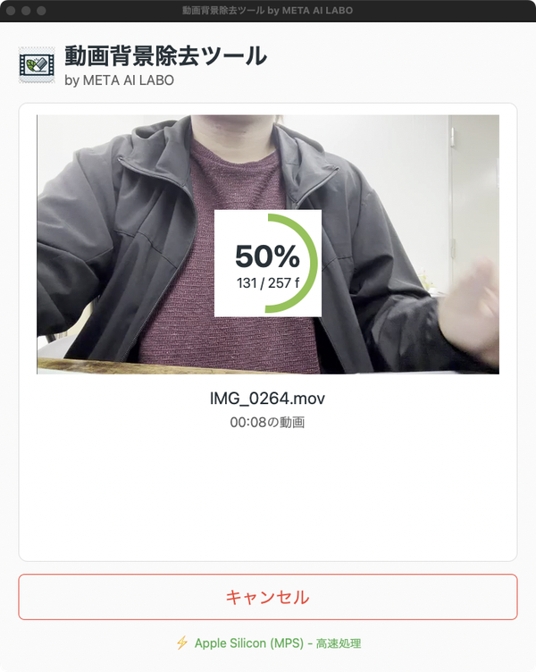
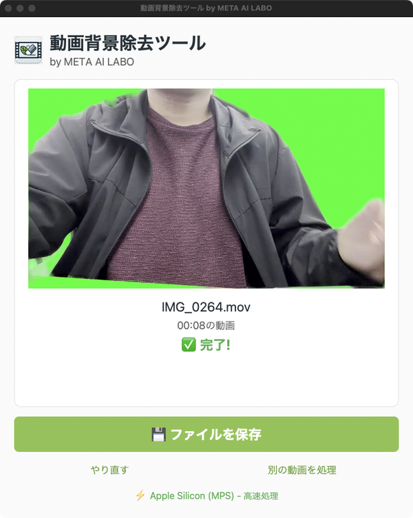

# RemoveBackgroundForVideo

[](https://github.com/masa-kaz/RemoveBackgroundForVideo/actions/workflows/build.yml)
[](https://www.gnu.org/licenses/gpl-3.0)

動画から人物の背景を自動的に除去し、透過動画（MOV ProRes 4444）を出力するデスクトップアプリケーションです。

## 特徴

- **AI背景除去**: RobustVideoMatting (RVM) を使用した高精度な背景除去
- **GPU対応**: NVIDIA CUDA / Apple Silicon MPS による高速処理
- **透過動画出力**: ProRes 4444形式でアルファチャンネル付き動画を出力
- **音声保持**: 元動画の音声トラックを保持
- **キャンセル機能**: 処理中いつでもキャンセル可能
- **シンプルなGUI**: 直感的に操作できるインターフェース

## ダウンロード

[Releases](https://github.com/masa-kaz/RemoveBackgroundForVideo/releases) から最新版をダウンロードしてください。

| ファイル | 対象環境 |
|---------|---------|
| `BackgroundRemover_Windows_GPU.zip` | Windows + NVIDIA GPU（推奨） |
| `BackgroundRemover_Windows_CPU.zip` | Windows（GPU不要、低速） |
| `BackgroundRemover_macOS.zip` | macOS (Apple Silicon M1/M2) |

## スクリーンショット

| 初期画面 | 処理中 | 完了 |
|---------|--------|------|
|  |  |  |

詳しい使い方は [操作マニュアル（Word形式）](docs/操作マニュアル_動画背景除去ツール.docx) をご覧ください。

## 使い方

1. アプリを起動
2. 「入力」で動画ファイルを選択（.mp4, .mov, .m4v）
3. 「出力」で保存先を指定（自動で `_nobg.mov` が付与）
4. 「処理開始」をクリック
5. 完了後、出力された透過動画を映像編集ソフトで使用

## 対応環境

| OS | GPU | 処理速度 |
|----|-----|---------|
| Windows 10/11 | NVIDIA (CUDA) | 高速 |
| macOS 11+ | Apple Silicon (MPS) | 高速 |
| Windows/macOS | CPU | 低速 |

## 開発者向け

### セットアップ

```bash
git clone https://github.com/masa-kaz/RemoveBackgroundForVideo.git
cd RemoveBackgroundForVideo
python -m venv venv
source venv/bin/activate  # Windows: venv\Scripts\activate
pip install -r requirements-dev.txt
```

### テスト

```bash
pytest              # 全テスト実行
pytest -m "not slow"  # E2Eテストを除外
pytest --cov=src    # カバレッジ付き
```

### ビルド

```bash
# macOS
./build_mac.sh

# Windows (GPU版)
build_gpu.bat

# Windows (CPU版)
build_cpu.bat
```

## ドキュメント

- [インストール手順](docs/INSTALLATION.md)
- [使い方](docs/USAGE.md)
- [アーキテクチャ](docs/ARCHITECTURE.md)
- [トラブルシューティング](docs/TROUBLESHOOTING.md)

## ライセンス

GPL-3.0 License（RVMモデルのライセンスに準拠）

## 謝辞

- [RobustVideoMatting](https://github.com/PeterL1n/RobustVideoMatting) - 背景除去AIモデル
